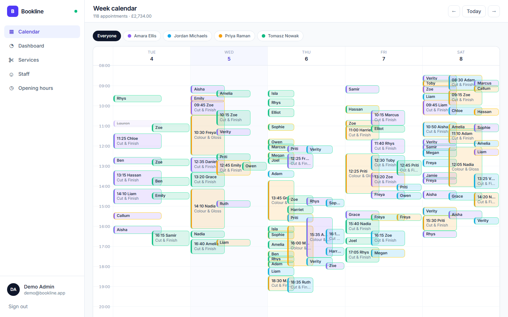
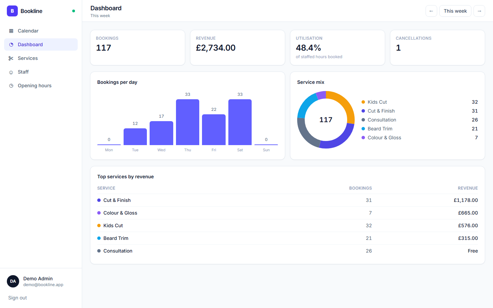
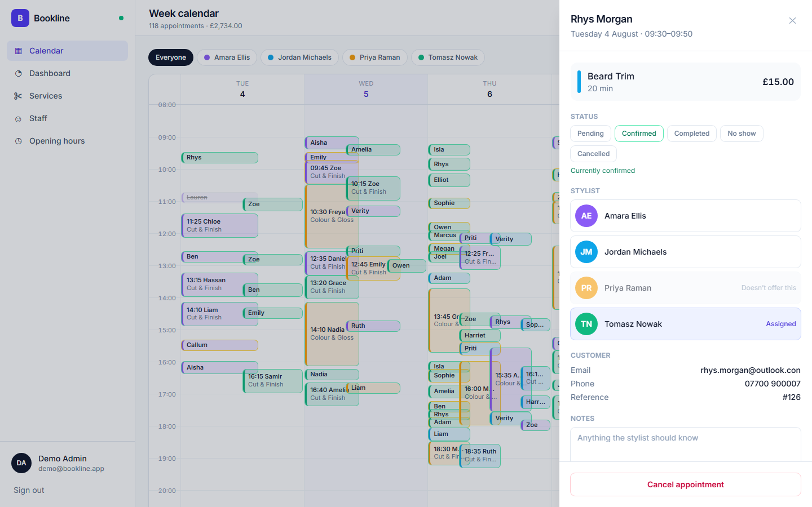
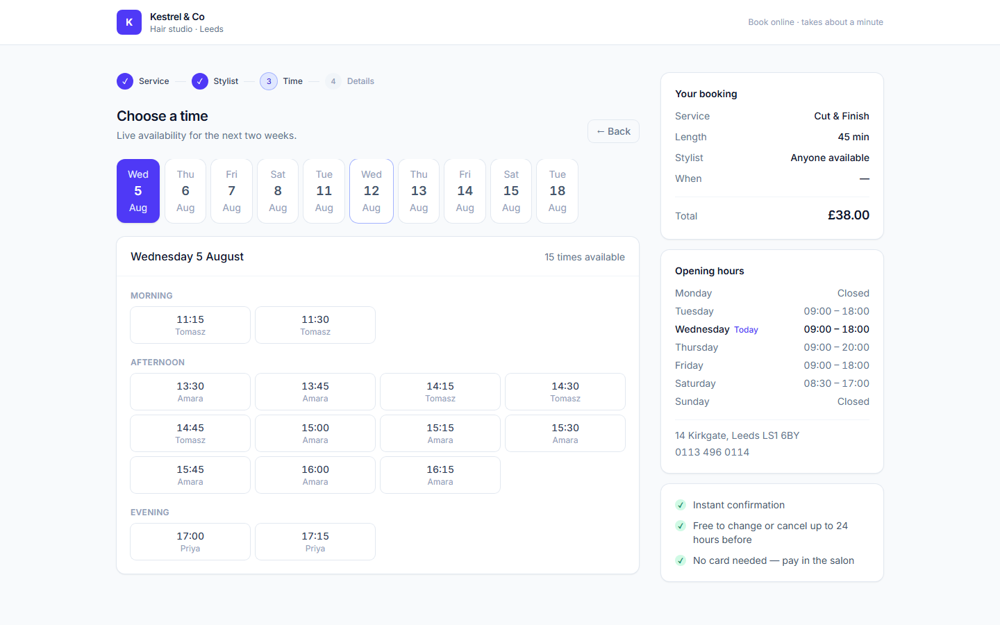
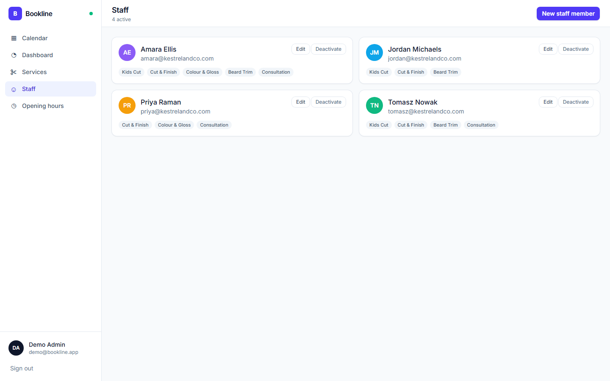

# Bookline

Appointment booking and staff scheduling for small service businesses — a public
booking page backed by genuine availability, and a staff dashboard built around a
drag-and-drop week calendar.

**Stack:** ASP.NET Core Web API (.NET 10) · React 19 + TypeScript (Vite) · Tailwind CSS v4 ·
SignalR · EF Core + SQL Server · ASP.NET Core Identity + JWT

---



<p align="center">
  
  
</p>
<p align="center">
  
  
</p>

More in [`docs/screenshots`](docs/screenshots). To regenerate them with both servers
running:

```bash
cd bookline-web
npm install --no-save playwright
node scripts/screenshots.mjs
```

---

## What it does

**Public booking page** — pick a service, pick a stylist (or "anyone"), see real
availability for the next 14 days, book, get a confirmation.

**Staff dashboard** — a week calendar with appointments as colour-coded blocks,
drag to reschedule, a detail drawer for each appointment, CRUD for services, staff
and opening hours, and a revenue/utilisation dashboard.

**Live updates** — a booking made on the public page appears on any open calendar
immediately, pushed over SignalR.

## The interesting part: availability

Everything else is CRUD. The one piece of real logic is working out what's bookable:

```
slots = (opening hours ∩ staff shift) − time off − existing appointments − buffers,
        stepped by a 15-minute interval
```

It lives in [`AvailabilityCalculator`](Bookline.Api/Services/AvailabilityCalculator.cs)
as a **pure function** — no database, no clock, no I/O. `nowUtc` is a parameter rather
than a call to `DateTime.UtcNow`, and the data arrives as already-loaded entities. The
EF-backed [`AvailabilityService`](Bookline.Api/Services/AvailabilityService.cs) is a thin
wrapper that loads and delegates.

Two details worth calling out:

**Times are stored in UTC; opening hours and shifts are wall-clock `TimeOnly`.** The
conversion happens **per date** inside the loop, so a 09:00 shift is `08:00Z` in BST and
`09:00Z` in GMT. Converting once outside the loop is a bug that only appears for a week
each spring and autumn.

**The booking endpoint re-derives availability server-side** rather than trusting the
slot the client posts back. One check rejects past times, times outside opening hours or
a stylist's shift, times during time off, times overlapping an existing appointment or
its buffer, and times off the 15-minute grid.

The admin reschedule endpoint deliberately applies a *different* rule — it only refuses
to double-book one person, because staff legitimately squeeze people in outside opening
hours.

## Running it

**Prerequisites:** .NET 10 SDK, Node 20+, and SQL Server LocalDB (ships with Visual
Studio, or the standalone [SqlLocalDB installer](https://learn.microsoft.com/sql/database-engine/configure-windows/sql-server-express-localdb)).

```bash
# 1. The JWT signing key is never committed - set your own
dotnet user-secrets set "Jwt:SigningKey" "any-string-of-at-least-32-characters" --project Bookline.Api

# 2. Trust the local HTTPS certificate (the SPA calls the API over https)
dotnet dev-certs https --trust

# 3. API — creates the database, applies migrations and seeds demo data on first run
dotnet watch --project Bookline.Api -lp https      # https://localhost:7293

# 4. SPA, in a second terminal
cd bookline-web
npm install
npm run dev                                         # http://localhost:5173
```

| URL | |
|---|---|
| `http://localhost:5173` | public booking page |
| `http://localhost:5173/login` | staff sign-in |
| `https://localhost:7293/scalar` | API documentation |

**Demo login:** `demo@bookline.app` / `demo`

> The demo password is deliberately weak, so Identity's password rules are relaxed in
> `Program.cs`. A real deployment would leave them at their defaults.

## Demo data

First run seeds a fictional salon — **Kestrel & Co, Leeds**: four stylists with their own
colours and shift patterns, five services, thirty customers, and ~236 appointments across
last week and this week. Dates are generated **relative to today**, so the calendar is
never empty.

Deliberately non-real: phone numbers use Ofcom's fictional `07700 900xxx` range, and
customer email domains end in `.con` rather than `.com`, so no address can resolve to
a real person.

The seed is idempotent and uses a fixed random seed, so rebuilding the database
reproduces exactly the same data:

```bash
dotnet ef database drop -f --project Bookline.Api   # then restart the API
```

## Layout

```
Bookline.Api/
  Controllers/      Public booking, auth, appointments, dashboard, CRUD
  Domain/           Entity classes - plain C#, no EF dependency
  Data/             AppDbContext, migrations, seeders, UTC value converter
  Services/         AvailabilityCalculator (pure) + AvailabilityService (EF)
  Auth/             JWT options, token issuing, claims helpers
  Hubs/             ScheduleHub + ScheduleNotifier
  Validation/       FluentValidation validators
Bookline.Api.Tests/ xUnit project
bookline-web/
  src/api/          typed client, DTO mirrors
  src/booking/      public booking flow (service → stylist → time → details)
  src/admin/        calendar, drawer, dashboard, CRUD screens, login
  src/lib/          formatting and calendar geometry
```

## API

```
GET    /api/public/{slug}                    name, timezone, opening hours
GET    /api/public/{slug}/services
GET    /api/public/{slug}/staff?serviceId=
GET    /api/public/{slug}/availability?serviceId=&staffId=&from=&to=
POST   /api/public/{slug}/bookings

POST   /api/auth/login
GET    /api/auth/me

GET    /api/appointments?from=&to=          all admin routes require a bearer token
GET    /api/appointments/{id}
POST   /api/appointments
PATCH  /api/appointments/{id}
DELETE /api/appointments/{id}                cancels; never hard-deletes
GET    /api/dashboard/summary?from=&to=
GET    /api/services      POST  PUT/{id}  DELETE/{id}
GET    /api/staff         POST  PUT/{id}  DELETE/{id}   (deactivates)
GET    /api/opening-hours PUT

hub    /hubs/schedule                        AppointmentCreated | Updated | Cancelled
```

Errors are `application/problem+json` (RFC 9457). Requests are validated with
FluentValidation, and validation failures return every bad field at once.

## Decisions worth explaining

**Money is `int` pence, never `decimal` or `double`.** Binary floating point can't
represent `0.1` exactly, so sums drift. `decimal` would be fine in C#, but JavaScript has
only `double` — integer pence is the only shape that survives C# → SQL → JSON → React
without loss. The unit is in the property name (`PricePence`) so it can't be misread.

**Prices are snapshotted onto the appointment.** Raising a service's price must not
rewrite last month's revenue.

**Nothing is hard-deleted.** Cancelling sets a status; removing a stylist deactivates
them. Appointment history references both, and the database enforces it — the foreign
keys from `Appointment` to staff/service/customer are `RESTRICT`, with only `Business`
cascading.

**Entities are never exposed over HTTP.** Requests and responses are DTOs, so a caller
can't set `PricePence` or `Status` on a booking, and staff email addresses aren't
published on the public page.

**The JWT is stored in `localStorage`.** Any script on the page can read it, so an XSS
bug would leak it; an `httpOnly` cookie can't be read by JavaScript but needs CSRF
protection on a cross-origin API. `localStorage` is the common SPA trade-off — noted here
because it's a decision, not an oversight.

## Known limitations

- **Double-booking is narrowed, not eliminated.** Two requests arriving milliseconds
  apart can both read "available" before either writes. Properly preventing it needs a
  lock or a database constraint on overlapping ranges, which SQL Server can't express
  declaratively. Short of that, the server-side re-check closes the realistic window.
- **JWTs can't be revoked** — no server-side record exists, so a stolen token works until
  it expires (120 minutes). The usual fix is a short-lived access token plus a revocable
  refresh token.
- **No confirmation email yet.** The confirmation screen says one is on its way; wiring
  an SMTP sender is outstanding.
- **The availability logic has no unit tests.** It was verified manually against the
  seeded data, including both sides of the DST boundary, but the pure-function design
  exists precisely so tests can be added cheaply.
- **Mobile hasn't been tuned.** The booking flow is responsive; the admin calendar
  assumes a desktop width.
